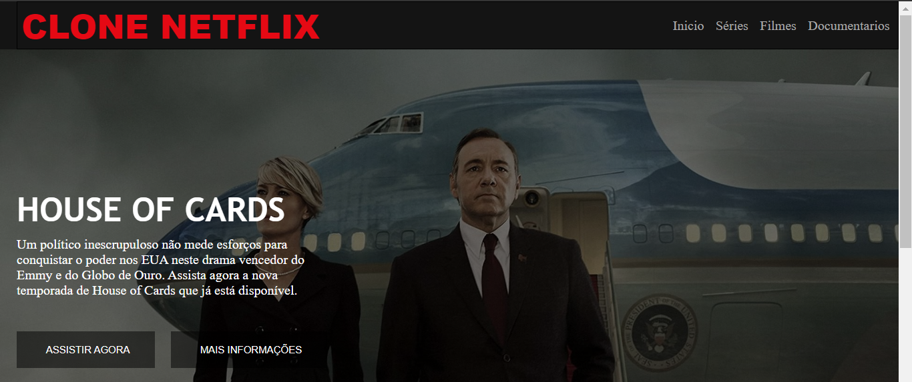
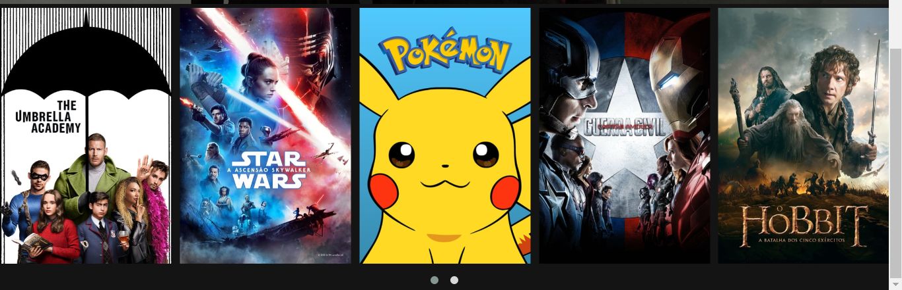
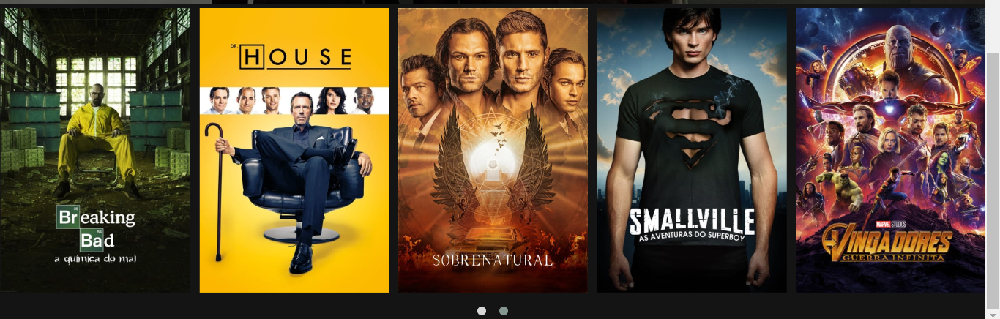

# CLONE DA NETFLIX 01
👨‍🏫INTERFACE DA PÁGINA INICIAL DA NETFLIX.

   
   
   

## DESCRIÇÃO:
- O aplicativo é um clone da interface do Netflix, projetado para exibir séries, filmes e documentários.
- Ele apresenta um cabeçalho com o nome "CLONE NETFLIX" e um menu de navegação com links para as seções "Início", "Séries", "Filmes" e "Documentários".
- Há uma seção principal que exibe um destaque com o título "HOUSE OF CARDS", uma breve descrição e botões para "Assistir Agora" e "Mais Informações".
- Abaixo do destaque principal, há um carrossel de filmes em miniatura.
- O aplicativo faz uso de bibliotecas externas como FontAwesome para os ícones e Owl Carousel para o carrossel de filmes. 

## EXECUTANDO O PROJETO:
1. Abra o arquivo `index.html` em um navegador da web.
2. **Navegação**: Use os links no cabeçalho para navegar pelas diferentes seções do aplicativo, como "Séries", "Filmes", etc.
3. **Assistir a um vídeo**: Clique no botão "Assistir Agora" para iniciar a reprodução do vídeo em destaque.
4. **Obter mais informações**: Clique no botão "Mais Informações" para obter detalhes adicionais sobre o conteúdo em destaque.
5. **Explorar o carrossel de filmes**: Role para baixo para ver o carrossel de filmes em miniatura e clique em qualquer filme para obter mais informações ou iniciar a reprodução.

## NÃO SABE?
- Entendemos que para manipular arquivos em `HTML`, `CSS` e outras linguagens relacionadas, é necessário possuir conhecimento nessas áreas. Para auxiliar nesse aprendizado, oferecemos cursos gratuitos disponíveis:
* [CURSO DE HTML E CSS](https://github.com/VILHALVA/CURSO-DE-HTML-E-CSS)
* [CURSO DE JAVASCRIPT](https://github.com/VILHALVA/CURSO-DE-JAVASCRIPT)
* [CONFIRA MAIS CURSOS](https://github.com/VILHALVA?tab=repositories&q=+topic:CURSO)

## CREDITOS:
- [PROJETO CRIADO PELO "vapatty6848"](https://github.com/vapatty6848/CloneNetflix)
- [PROJETO EDITADO PELO VILHALVA](https://github.com/VILHALVA)

